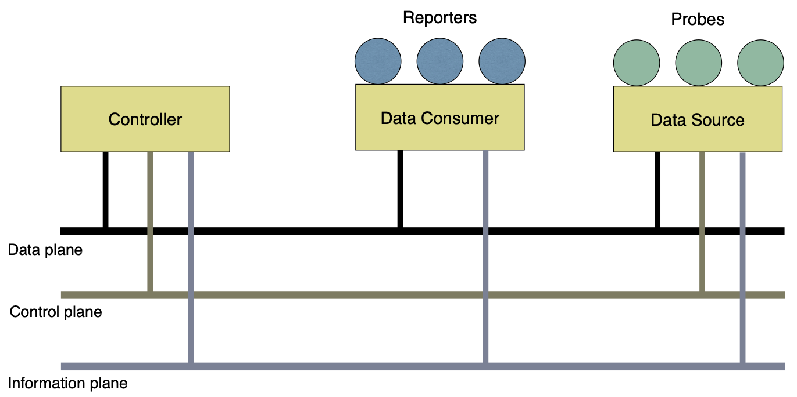

# Lattice Monitoring Framework
This repository contains the source code of the Lattice Monitoring Framework.

The main components of the framework are:

- the Data Sources and Probes
- the Data Consumers and Reporters
- the Monitoring Regulator / Controller

## Design of Lattice

The [design of Lattice](docs/Design.md) is presented, showing the main features.

plus [some of the background ideas](docs/Background.md).
## Build Instructions

Information about building Lattice can be found [here](docs/Build.md)

## Programming with Lattice

Lattice has been written in Java.  A [description of the packages](docs/JavaPackages.md) is shown.

### Demos

Some [demo info](docs/Demo.md) is shown.

## Papers with Lattice

Papers that are about Lattice can be found [here](docs/LatticePapers.md)

