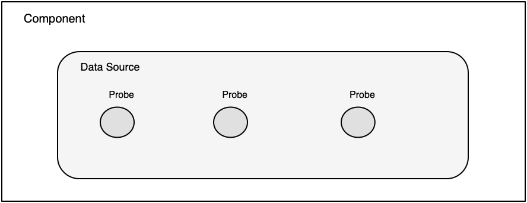
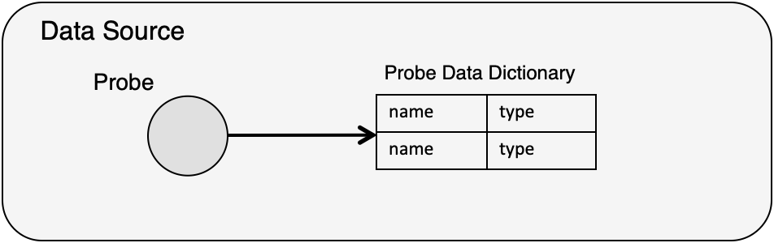
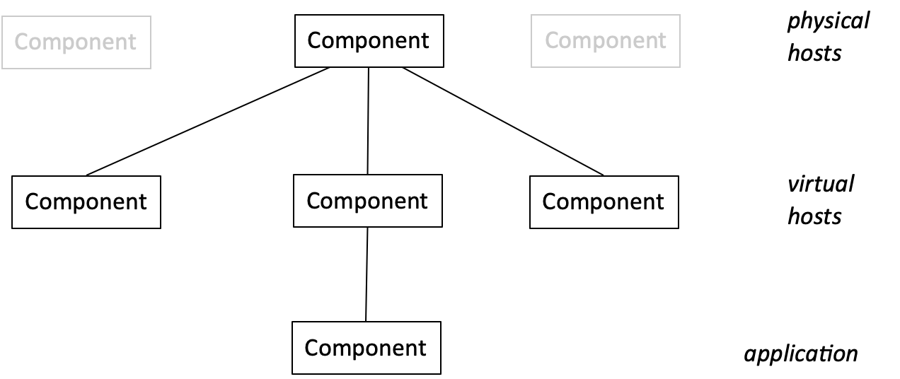
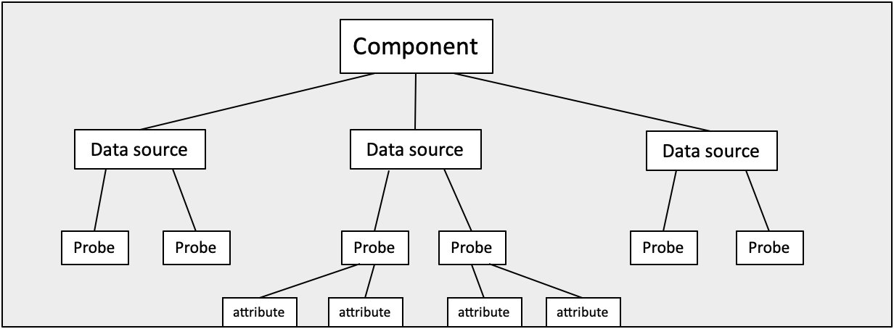
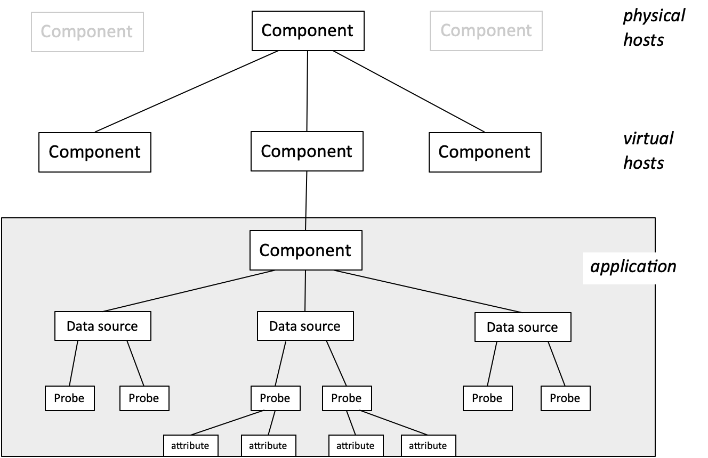
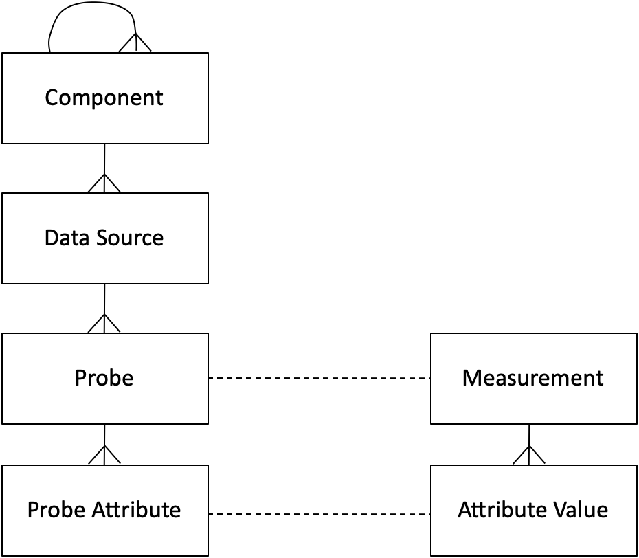
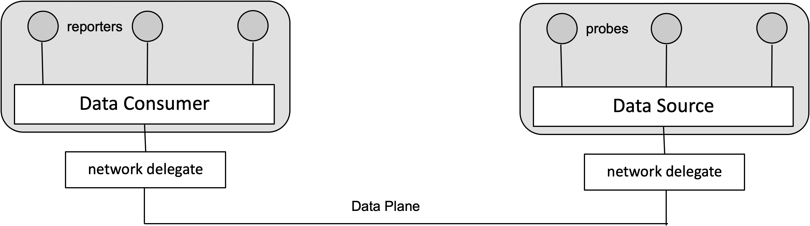

## Background

In highly dynamic environments, such as cloud (with virtual machines or containers) or networks (with virtual networks or slices) there is a need for a lot of monitoring data.  Much of this data is consumed by a number of management components.

For example, in a cloud the Orchestrator may need to process Elasticity Rules and SLA Rules for a service.
To evaluate these rules we need monitoring data sent from probes within the infrastructure and from the application. We can determine the exact probes which need to be turned on, and these probes will send the monitoring data which will be matched against the rules. The Orchestrator also needs monitoring data for initial placement of a VM and for subsequent migration of a VM.

There are multiple components in such systems, including:

- physical hosts
- virtual hosts
- physical networks
- virtual networks
- applications

There can be 100s or 1000s of monitoring probes producing data, with multiple consumers of the monitoring data.

Physical hosts provide the environment for virtual hosts.  We need monitoring info on:

- cpu usage
- memory usage
- etc

Physical networks provides access for virtual network . We need monitoring info on:

- network bandwidth usage
- flow rates
- etc

Virtual hosts provide the environment for the deployed service applications.  We need monitoring data on:

- %age of cpu used
- %age of memory used
- etc

For any application, there may be monitoring probes that return app specific values, such as:

- queue length
- no of concurrent users
- etc

## Overview

Here there is an Overview of the main concepts of Lattice.

#### Data Source
A Data Source is a control and interaction point for monitoring.

- It is embedded in a component.
- Is a wrapper for actual producers of data, which are the probes.
- Can turn each probe on and off.
- Can set data rate for each probe.
- A probe sends a set of attribute-values with each measurement.
- Ideally a Data Source is fully dynamic.
- Can then add or delete probes at runtime.
- Can also reprogram a probe to add new attribute-values or adjust existing ones.

#### Probes

A probe is a producer of monitoring data.

- It can send a stream of data at a specified data rate or it can respond to a request
- The data sent is defined in a data dictionary. It only sends attribute-values that are defined

- The Probe defines attribute-type information in the data dictionary like:
 * name: memory-usage
 * type: integer
- The monitoring data sent matches the attributes which are defined by the probe
  * name: memory-usage
  * type: integer
  * value: 456000000

- Probe configurations need to be adaptable to different situations.
  * A probe may collect data from an existing instrument, and will have fixed attributes.
  * There can be a fixed set of probes.
  * There can be fully dynamic probes, so the number of attributes can change, and new probes can be created.

#### Probe Directory

A Probe Directory can be used to keep information about all the components in a system, the data sources, the probes, etc.

The Probe Directory needs to hold:

- the structure of the components
- the data sources in a component
- the identity of each probe
- the probe’s data dictionary
- the data source the probe is in

##### Probe Directory Model

The components in the Probe Directory model are related, in a hierarchy

Each component can have one or more data sources.  
Each data source can have one or more probes.  
Each probe can have more or more attributes.  

They are combined into a full model.

The model with the components, data sources, and probes can is aligned with the measurements that at sent by the probes.

- This model is shown on the left.
- On the right is the model for a measurement.
- Probes send measurements.
- Each attribute-value must be predefined in a probe attribute.

#### Instances of the Model

Information held in the Probe Directory.

A measurement has values for all the attributes defined in the probe data dictionary 

## Networking

We need a mechanism to get monitoring data from a Data Source into the Data Consumer.

There are many options:

- TCP connection
- IP multicast
- publish / subscribe system
- event bus
- etc

There is no obvious or fixed approach.

We may need more than one mechanism in a large distributed system like a cloud.

By using a networking delegate that does the real communications, the Data Source and the Data Consumer can be insulated from the actual networking details.

We need to define the over-the-wire format of the Measurement.  This too can have many options:

- XDR
- JSON
- XML
- etc

The network delegate implements the actual networking.

The Data Source has no fixed networking methods. 

