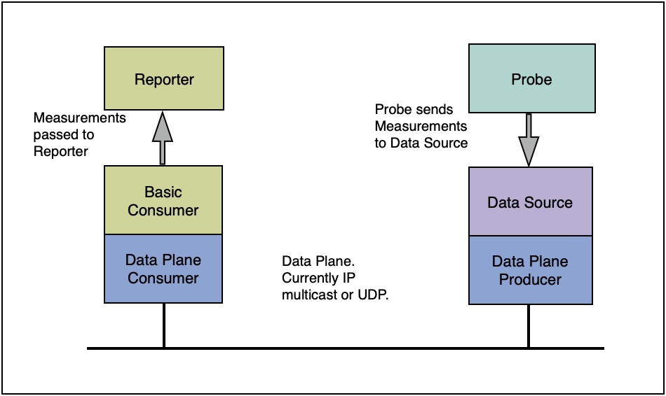

# Demo

Here are some demos of using the Lattice monitoring framework.

The main classes are in the package `mon.lattice.appl.demo`

In the demos there are implementations of the elements presented in the following model.  

- A DataSource acts as a control point and a container for one or more Probes.  
- Each Probe defines the attributes that it can send in a set of ProbeAttribute objects, that specify the name, the type, and the units of each value that can be sent.
- When a Probe sends a Measurement, the values sent are directly related to the Probe Attributes.
- The Probe sends each Measurement to the Data Source for transmission.  
- The Data Source passes these measurements onto the Data Plane, where they are encoded into an on-the-wire format, and then sent over the Data Plane distribution network. 
- The receiver of the monitoring data decodes the data and passes reconstructed Measurements to the monitoring Consumer.
- The Consumer passes them up to the Reporters.

In this snapshot, the Data Plane implementation can be done using (i) IP multicast, or (ii) as UDP.  The distribution is independent of the core parts of the system, and can easily be replaced by a different Data Plane distribution framework, such as publish/subscribe.

## Code

The following is the setup of a Component which has a Data Source, and connects to the Data Plane using IP Multicast.  It uses the `MulticastDataPlaneProducer` class.

	// set up data source
	Data Source ds = new BasicDataSource();

	// set up multicast address for data
	MulticastAddress address = new MulticastAddress(addr, dataPort);

	// set up data plane
	ds.setDataPlane(new MulticastDataPlaneProducer(address));

	// connect to all the planes
	ds.connect();

