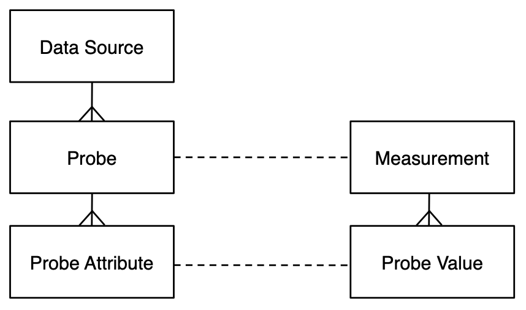

# Design

A number of existing monitoring systems such as Ganglia, Nagios , MonaLisa , and GridICE have addressed monitoring of large distributed systems, but they have not addressed the rapidly changing and dynamic infrastructure seen in service clouds.

The monitoring system for a virtualized systems needs to feed data into a Service Manager / Orchestrator so that it can manage the services deployed. Over time, it is expected that the management capabilities of the Service Manager  / Orchestrator will expand to include new functions. As a consequence we need the monitoring system to be adaptable, flexible, and extensible in order to support the expanding functionality.
To address all of the requirements and functionality of the virtualized environment we have determined that the main features for monitoring which need to be taken account of are:

- *scalability* — to ensure that the monitoring can cope with a large number of probes
- *elasticity* — so that virtual resources created and destroyed by expanding and contracting
networks are monitored correctly
- *migration* — so that any virtual resource which moves from one physical host to another is monitored correctly
- *adaptability* — so that the monitoring framework can adapt to varying computational and network loads in order not to be invasive
- *autonomic* — so that the monitoring framework can keep running without intervention and reconfiguration
- *federation* — so that any virtual resource which resides on another domain is monitored correctly
- *isolation* — so that monitoring of VEEs from different services are not mixed and are not visible to other services

To establish such features in a monitoring framework requires careful architecture and design. The following sections present the Lattice monitoring framework which we have designed and built for the purpose of monitoring dynamic environments.

In many systems, **probes** are used to collect data for system management. In this regard, Lattice also relies on probes. However, to increase the power and flexibility of the monitoring we introduce the concept of a **data dource**. A data source represents an interaction and control point within the system that encapsulates one or more probes. A probe sends a well defined set of attributes and values to a data consumer at a predefined interval.

The goal for the monitoring system is to have fully dynamic data sources, in which each one can have multiple probes, with each probe returning its own data. The data sources will be able to turn on and turn off probes, or change their sending rate dynamically at run time. A further useful facility for a data source is the ability to add new probes to a data source at run-time. By using this approach we will be able to instrument components of the system without having to restart them in order to get new information.

Such an approach for data sources and probes is important because in many systems that need monitoring , the Management / Orchestration needs to grow and adapt for new requirements over time. If the monitoring system is a fixed point then such Management / Orchestration will be difficult to adapt and amend.
To meet all the criteria outlined requires careful architecture and design. Many monitoring systems rely on simple data transmission. From a design point of view, this approach is successful, although limited.

For Lattice, we believe it is better if the monitoring framework design encapsulates separate planes for data, for meta-data, and for control. This allows us to build a system that has the desired behaviour and meets the requirements.
In Lattice, the separate planes for connecting the monitoring framework are:

- the *data plane* — for distributing measurements from the Probes and Data Sources to the consumers. This is the same monitoring data plane shown in figures 3, 4, and 5.
- the *control plane* — for distributing control messages to the Data Sources and the Probes.
- the *information plane* — which holds all the meta-data relating to measurements sent by Data Sources and Probes.

### Data Source

A Data Source can manage several Probes, and has plugins for the monitoring data plane, the control plane, and the information plane, so that it is possible to change the implementation of each plane easily and independently of the other planes. This will allow users to choose the best solution for different setup scenarios. We have a control interface so that Data Sources can be controlled from a Manager, via the control plane, and Probes can also be controlled via the Data Source. We can then develop control strategies so that it is possible to manage the lifecycle of a Probe from a Manager rather than having everything programmed-in.

As there could be hundreds or thousands of probes in a Lattice system, it is important that each probe has a unique identity. Without an identity, it is not possible to identify individual probes. Using the identity it is possible for the Data Source to address the probe in order to turn it on, turn it off, change its rate of sending, or find its status. It is the probe’s identity that also allows the combination of its data with other probe’s data to create the complex information.

### Probes

In many systems, the Probes collect data at a given data rate, and transmit measurements immediately, at exactly the same data rate. In Lattice we can decouple the collection rate and the transmission rate in order to implement strategies which aid in efficiency.

 
The collection of measurement data is a fundamental aspect of a Probe. The collection strategies will be:

- at data rate, which collects some measurement data at a regular data rate.
- on event, where a measurement is not collected at a specified rate, but is passed to the
probe as an event from another entity. 

The transmission strategies are:

- at data rate, this is the main strategy, which transmits measurements at a regular data rate.
- on change, where a measurement is only transmitted when the data that is read is different from the previous data snapshot. This can be elaborated so that only a specific set of attributes are included when determining if there has been a change.
- filtering, where a measurement is only transmitted if the filter passes the value. Examples of such filtering strategies are:

	* above threshold, where a measurement is only transmitted when an attribute of the data that is read is above a specified threshold. Otherwise, nothing is transmitted.
	* below threshold, where a measurement is only transmitted when an attribute of the data that is read is below a specified threshold. Otherwise, nothing is transmitted.
	* in band, where a measurement is only transmitted when an attribute of the data that is read is between an upper bound and a lower bound. Otherwise, nothing is transmitted.
	* out of band, where a measurement is only transmitted when an attribute of the data that is read is above an upper bound or below a lower bound. Otherwise, nothing is transmitted.
	
	although any kind of filter can be defined.
	

For a probe to be part of Lattice we can either write the probe from scratch or use existing sensors and instrumentation and adapt them for Lattice. The probes can be implemented in various ways to get the data they need to send. They can:

- read the data directly from the relevant place
- be an adaptor for an existing instrument by wrapping the existing one
- act as a bridge for an existing instrument by allowing the existing one to send it data.

in order to gather the required information.

### Probe Data Dictionary

One of the important aspects of this monitoring design is the specification of a Data Dictionary
for each probe. The Data Dictionary defines the attributes as the names, the types and the
units of the measurements that the probe will be sending out. This is important because the
consumers of the data can collect this information in order to determine what will be received.
At present many monitoring systems have fixed data sets, with a the format of measurements being pre-defined.  The advantage here is that as new probes are to be added to the system or embedded in an application, it will be possible to introspect what is being measured. This is important in dynamic systems, because many of the Probes will not be known in advance.

The measurements that are sent  will have value fields that relate directly to the data dictionary. To determine which field is which, the consumer can lookup in the data dictionary to elaborate the full attribute value set.

### Data Consumer

A Data Consumer acts as a consumer of the measurements from a **Data Source**. It is connected to the Data source over the same Data plane.  In the same way that a Data Source has a number of different probes that collect data, a Data consumer can have a number of Reporters. Each of the measurements are passed on to all the Reporters that have been added to the Data Consumer.  Each Reporter can have it's own independent functionality.

### Regulator

In order to have some kind of control over the whole monitoring system, the role of a regulator has been devised. It's job is to ensure that the monitoring system does not flood the network or overload any applications.
A monitoring system that supports the deployment and configuration of all the required monitoring entities at run-time, as well as their dynamic control is desirable to have. This allows to dynamically reshape the deployment, configuration and behaviour of the monitoring system according to the status of the main virtualized system that needs to be monitored.

Such a Lattice Monitoring Controller can support the following dynamic run-time functionalities:

- to Start / Stop a Data Source monitoring agent on host / resource,
- to Load / Unload a probe (on a Data Source) with specific attributes ,
- to Activate / Deactivate a probe,
- to Set a probe measurements collection / sending rate,
- to Start / Stop a Data Consumer monitoring agent on host
/ resource,
- to Load / Unload a reporter (on a Data Consumer
monitoring agent),
- to Configure a reporter to use a particular persistent
storage system for storing the collected measurements.

These mechanisms allow for building the required monitor- ing control loop while enabling dynamic control features for its main monitoring elements.

### Measurements

The actual measurements that get sent from a probe will contain the attribute-value fields together with a type, a timestamp, plus some identification fields. The attribute-values contain the information the probe wants to send, the type indicates what kind of data it is, and the timestamp has the time at which the data was collected. The identification fields are used to determine for which component or which service, and from which probe this data has arrived from.

When using Lattice, if there are multiple components which need monitoring and there are multiple running services and any of these can have multiple probes, then the consumer of the data will be able to differentiate the arriving data into the relevant streams of measurements.

### Data Plane

In order to distribute the measurements collected by the monitoring system, we use the Data Plane. For most Data Plane uses, we need a mechanism that allows for multiple submitters and multiple receivers of data without having vast numbers of network connections. For example, having many TCP connections from each producer to all of the consumers of the data for that producer would create a combinatorial explosion of connections. Solutions to this include IP multicast, Event Service Bus, or publish/subscribe mechanism. In each of these, a producer of data only needs to send one copy of a measurement (in a packet) onto the network, and each of the consumers will be able to collect the same packet of data concurrently from the network.

In order to avoid a reliance on any particular networking technology, there is a Data Plane plugin capability that allows the actual implementation for data distribution to be set at run time. Such an approach works well for virtualized infrastructures, such as Clouds, because in those cases there are both multiple producers and multiple consumers.

One of the easiest solutions for the Data Plane is to use IP multicast because it has a very simple mechanism to distribution. However, IP multicast is a UDP based networking technology, and as such it has very similar attributes in terms of reliability and packet loss. It is possible to consider a more substantial framework which has higher reliability and more flexibility for the Data Plane as well.

### Control Plane

In many monitoring systems, the probes are reporting their status at a fixed data rate and are always sending data onto the network. Such an approach is not scalable and does not fit with the design goals of Lattice. The monitoring system for Lattice requires both scalability and flexibility in order to operate effectively. Consequently, we need to have a level of control over all of the Data Sources and all of the Probes, as described in the **Regulator** section.

We have defined operations that allow individual Probes to be turned on and turned off independently of any other Probe. Furthermore, any Probe can have its data rate changed on-the-fly at run-time. It is by using these capabilities that we can achieve the scalability and flexibility we need from the monitoring system.

We have defined the Control Plane to support all of the above functionality. To enact this we have devised the following artefacts:

- a control protocol which sends the control messages,
- a controller-manager which decides which Probes to interact with,
- a policy engine which takes a global view of all the monitoring information and interacts with the controller-manager

Once these are built we have dynamic and autonomic control over the monitoring.

### Information Plane

The Information Plane allows interaction with the Information Model for the monitoring framework. It holds all of the data about Data Sources, Probes, and Probe Data Dictionaries present in a running system. As Measurements are sent with only the values for the current reading, the meta-data needs to be kept for lookup purposes. By having this Information Plane, it allows consumers of measurements to lookup the meaning of each of the fields.
Within Lattice, there are key lifecycle points where data is added to the information model. They are when a Data Source is activated, and when a Probe is activated. This data can be looked up as required.

For example, if a measurement has a probe ID of 4272, as seen earlier, then a Manager can interact with the Information Plane to extract the actual name of the probe.
In many older monitoring systems this information model is stored in a central repository, such as an LDAP server. Newer monitoring systems use a distributed approach to holding this data. For Lattice, the Information Plane also relies on a plugin component. Currently, we have an implementation which uses a Distributed Hash Table.
